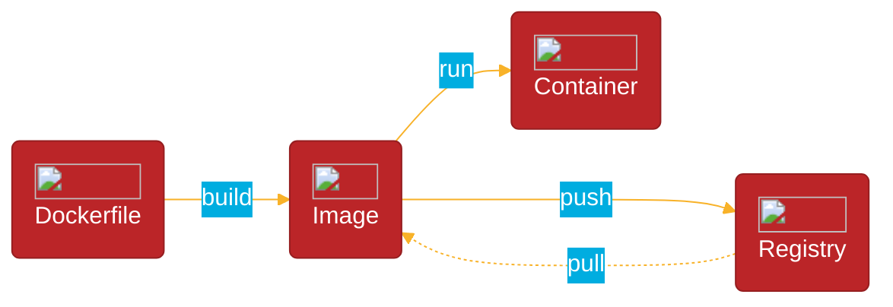

# Writing a Dockerfile for a C# Application

## Introduction:
Docker provides an efficient way to package and distribute applications using containers. In this post, we'll explore the process of writing a Dockerfile to containerize a C# application. We'll cover the essential steps, including building the image, copying the application files, and running the application inside a Docker container.

## Concepts



## Prerequisites:
Before getting started, make sure you have Docker installed on your machine. If it's not installed, then you can download it from [here](https://docs.docker.com/get-docker/).

## Step 1: Create a new Dockerfile
Start by creating a new text file named "Dockerfile" in the root directory of your C# application. By convention, Dockerfiles are typically named "Dockerfile" without any file extension.

## Step 2: Define the base image
In the Dockerfile, begin by specifying the base image for your C# application. For example, to use the official .NET 7 SDK as the base image, include the following line:

* `FROM mcr.microsoft.com/dotnet/sdk:7.0 AS base` 

## Step 3: Set the working directory
Next, set the working directory inside the container where your application's files will be copied. Use the following command:

* `WORKDIR /app`

## Step 4: Copy the application files
Copy the necessary files from your local machine to the container. For a basic console application, you can copy the entire project folder using the following command:

* `COPY . ./`

 The "COPY" instruction takes two parameters: the _source_ and the _destination_.

## Step 5: Build the application
Now, build the C# application inside the container using the appropriate build command. For example, for a .NET Core application, you can run the following command:

* `RUN dotnet build -c Release`

## Step 6: Run the application
To run the application inside the container, use the "CMD" instruction. This instruction specifies the command to execute when the container starts. For a console application, use the following command:

* `CMD ["dotnet", "run"]`

## Step 7: Build the Docker image
In your terminal, navigate to the directory containing the Dockerfile and run the following command to build the Docker image:

* `docker build -t <YOUR-IMAGE-NAME> .`

>In the docker build command, the dot (".") represents the build context. The build context is the directory or path that contains the files and directories you want to include in the Docker image. The dot (".") is often used as the PATH argument to specify the current directory as the build context.

## Step 8: Run the Docker container
Once the image is built, you can create and run a Docker container based on that image. Use the following command:

* `docker run <YOUR-IMAGE-NAME>`

## A complete `Dockerfile`

```yml
FROM mcr.microsoft.com/dotnet/aspnet:7.0 AS base
WORKDIR /app

# Copy everything
COPY . .
# Restore as distinct layers
RUN dotnet restore
# Build and publish a release
RUN dotnet publish -c Release -o out

# Build runtime image
FROM base AS final
WORKDIR /app
COPY --from=build /app/out .
ENTRYPOINT ["dotnet", "DotNet.Docker.dll"]
```

## Conclusion:
In this post, we've covered the essential steps for writing a Dockerfile to containerize a C# application. By following these steps, you can easily package and distribute your C# applications using Docker containers, enabling consistent deployment across different environments.

Remember, Dockerfiles can be customized based on your specific requirements. You can include additional commands to handle dependencies, expose ports, or optimize the container image. Experiment and explore the various possibilities to make the most of Docker and containerization for your C# applications.

## Links:
* [Get Docker](https://docs.docker.com/get-docker/)
* [Introduction to .NET and Docker](https://learn.microsoft.com/en-us/dotnet/core/docker/introduction)
* [Tutorial: Containerize a .NET app](https://learn.microsoft.com/en-us/dotnet/core/docker/build-container?tabs=windows)
